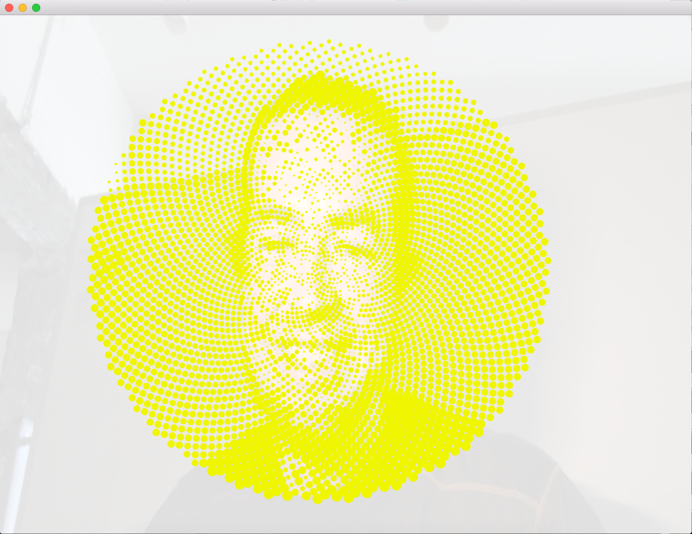

# selfiejockey

a collection of live video filters for selfiejockeying

written using [open frameworks](https://openframeworks.cc/), [opencv](https://opencv.org/) 
& [ofxFaceTracker](https://github.com/kylemcdonald/ofxFaceTracker) to identify faces & expressions in the live video stream

